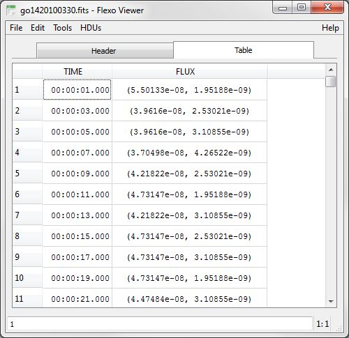

## Программа для работы с данными в формате FITS FlexoViewer ##

### Недостатки имеющихся решений ###

Стандартные средства просмотра файлов стандарта FITS ориентированы в первую очередь
на работу с изображениями, поэтому скорость работы с крупными таблицами крайне невысока.
Кроме того не поддерживаются таблицы, содержащие в ячейках многомерные массивы,
и не возможно отображение элементов в виде, отличном от хранения. Возможности
построения графиков так же ограничены. При этом часто необходим достаточно 
универсальный инструмент, предоставляющий возможность работать с FITS-файлом, без написания
какого-то кода. Для обеспечения этих целей разрабатывается программа Flexo Viewer.

Для построения графического интерфейса используется библиотека [Qt](http://qt-project.org/ "Qt"). Это широко
используемая, кроссплатформенная, объектно-ориентированная библиотека. Кроме
создания пользовательского интерфейса Qt предоставляет многоплатформенные средства
для работы с файловой системой, передачи информации по сети, обеспечения в приложении
поддержки скриптов и многое другое.

Приложение Flexo Viewer способно читать FITS-файлы, запакованные архиватором GZip, без предварительной
распаковки. Так же возможен экспорт данных в текстовый формат.

Настройки приложения, такие как размер и положение окон, список недавно открытых файлов, хранятся в зависимости
от операционной системы либо в реестре, либо в конфигурационном файле в домашней директории.

Из имеющихся средств работы с таблицами
широко распространены Fv из пакета FTOOLS разработки научной группы HEASARC \cite{fv} и
TOPCAT разработки Бристольского университета \cite{topcat}.
Оба инструмента не позволяют просматривать данные, содержащие в ячейках многомерные массивы.

Как пример на рисунке показано, как программа Fv отображает двумерный массив поля "FLUX". Двумерный массив отображается как вектор.

В программе Flexo Viewer та же самая таблица отображается во вполне понятном виде.

Программа Fv, помимо этого не позволяет строить графики функций временного хода. Этой
возможностью обладает программа TOPCAT, но она не умеет строить графики спектров, и
в ней ограничены возможности просмотра заголовков. Фактически для таблицы выводятся
только ее название, количество полей, количество строк и комментарии.

### Работа с таблицами ###

Основная сложность разработки программы заключалась в большом размере
таблиц: так суточные таблицы для большинства приборов содержат несколько сотен тысяч строк,
а суточная таблицы прибора БРМ, временное разрешение которого 1 мс, содержит
более 8,5 миллионов строк. При таких объёмах недопустимо дублирование
одних и тех же данных при их отображении в разных видах (таблица и график), а
в отдельных случаях нецелесообразна даже полная загрузка файла в память. Поэтому
программа разрабатывалась на основе паттерна модель-представление, идея которого
сводится к отделению части, ответственной за отображение информации от части, производящей
считывание и хранение данных. В соответствии с этим было разработано две основных модели:
одна - для заголовков, другая - для таблиц.

#### Отображение заголовка ####

Модель заголовков загружает заголовок полностью в список с произвольным доступом структур, содержащих
две строки (ключ и комментарий) и одну переменную типа QVariant (значение), которая может содержать в
себе данные разных типов. Загрузка данных происходит в отдельном потоке, поэтому не приводит к зависанию
пользовательского интерфейса. Для обеспечения возможности сортировки таблицы используется промежуточная модель, перенаправляющая запросы от представления к соответствующим строкам в модели данных, порядок самих данных при этом не изменяется. Это позволяет снизить стоимость процесса сортировки.

Для упрощения нахождения нужного ключа, записи подсвечены разными цветами, в зависимости от того,
к какому типу она относится. 

Всего предусмотрено 7 типов ключей:

- служебный ключ, 
- ключ, описывающий поле данных, 
- ключ с именем расширения, 
- история, 
- комментарий,
- пользовательский ключ.
 
Для ключей, описывающих поле данных, задается два цвета, которые чередуются, позволяя
визуально разделять описание разных полей. К служебным ключам относятся все зарезервированные ключи, не являющиеся
комментарием или историей и не описывающие поле данных. К пользовательским ключам относятся все остальные
ключи.

Для заголовков с большим количеством ключей, можно включить сортировку.
Функция активируется через меню, а выбор направления сортировки и столбец выбираются путем нажатия
на заголовок интересующей колонки.

Также с помощью меню или с помощью горячей клавиши можно вызвать панель поиска.
При вводе текста в строку происходит отбор подходящих значений и список перематывается к первой подходящей записи.
Кнопками на панели поиска можно переходить между найденными значениями, пункт меню "Find Next" 
отображает следующий или предыдущий найденный элемент, в зависимости от того, какая кнопка была нажата последней.

#### Отображение блока данных ####

Модель таблиц рассчитана на большие объёмы данных, поэтому она загружает одновременно не более 57600
(20 блоков данных в FITS-файле) элементов с округлением вниз с точностью до строки. Загруженный
набор данных хранится в одномерном векторе элементов Boost::Variant (хотя элементы Boost::Variant занимают меньше места,
чем QVariant, но при отображении требуется дополнительное приведение типа). Все элементы хранятся в ряд.
Первый элемент строки `n + 1` следует за последним элементом строки `n`. Структурированные элементы таблице
раскладываются аналогично самой таблице. Помимо этого модель содержит список имён заголовков полей и данные,
необходимые, для нахождения элементов по индексам таблицы. При обращении к
строке приближенной к краю, не являющемуся началом или концом файла, загруженного набора данных ближе, 
чем на 10% его объёма, происходит считывание следующих в этом направлении строк в количестве не 
превышающем 40% его объёма с округлением вниз с точностью до строки. Затем происходит удаление
строк, в количестве равном числу загруженных строк, с противоположной стороны набора данных. Загрузка
и удаление элементов происходит в отдельном потоке, и не приводит к замораживанию пользовательского
интерфейса. Для предотвращения обращения к одному набору данных из разных потоков используются
блокирующие мьютексы. Для сокращения времени блокировки, при загрузке новых данных, происходит загрузка во
временные вектора, по 2880 элементов, которые подсоединяется к "хвосту" основного блока данных. Процессы
загрузки и удаления ставятся в очередь, если размер очереди превышает 20 операций, то из неё удаляются наиболее
старые операции загрузки. Если операций загрузки в очереди не осталось, но её размер превышает 20, то добавление
новых операций в очередь приостанавливается, до тех пор, пока размер очереди не снизится ниже 20. Если в очереди
нет операций, а в память загружено меньше оптимального числа элементов, то создаются новые операции
загрузки. Если при отображении представление не может получить доступ к блоку загруженных данных (происходит
изменение вектора с данными), то выводится пустая ячейка. Впоследствии, когда набор данных вновь будет
свободен, модель пошлёт сигнал представлению, которое вновь обратиться к модели.

Если данные хранятся в таблице в одну строку (как это бывает в данных GOES и SOHO), удобно бывает их
перегруппировать, чтобы сразу отобразить, как таблицу, а не как набор массивов. 

Это производится по следующему алгоритму:

1. Определяется количество строк по одинаковой для всех полей размерности массивов;
2. Определяются новые размеры ячеек;
3. В таблицу вставляются ячейки из строки, в порядке соответствия виртуальному номеру строки,
т.е. последовательно вставляются элементы с одинаковым индексом размерности взятой за
номер строки.

При отображении структурированных ячеек, массивы представляются в круглых скобках с разделёнными запятыми
элементами, битовые поля в виде нулей и единиц, разделённых двоеточием. 
Если название и тип поля соответствует одному из заранее предопределённых, 
то оно может быть отображено особым образом. Так дата и время, записанные
в модифицированных юлианских днях отображаются в понятном виде.

При наведении мыши на элемент таблицы, выводится подсказка, с отображением неструктурированных значений
из текущей строки с указанием единицы измерения. Номер выбранной ячейки отображается в правом нижнем
углу. Переход между модулями файла осуществляется с помощью меню. При необходимости меню можно
"оторвать", тогда появится окно, со списком модулей.

### Построение графиков по выборке данных ###

Построение графиков функций для их анализа включает в себя множество вопросов, к которым относится
построение огибающих кривых и аппроксимирующих  функций. Поэтому вместо того, чтобы тратить силы
на реализацию подобных возможностей, было принято решение использовать существующие инструменты,
а для обеспечения удобства при работе с данными запускать их из программы, передавая нужные для
построения данные.

Для этого специальный модуль сериализирует данные из модели во временный файл или разделяемую
область памяти. Временный файл используется для больших блоков данных. Затем модуль запускает 
программу, строящую один или несколько графиков, передавая ей в
качестве параметров путь к временному файлу, или передает информацию на вход программы 
(в UNIX-подобных операционных системах), или через COM-объект (если поддерживается программой).
По завершению порожденного процесса, модуль удаляет временный файл. Если пользователь захочет
закрыть программу Flexo Viewer, до завершения порожденного процесса, процессу будет послан
сигнал завершения.

Для выбора нужных для построения данных пользователь может через пункт меню
"plot" вызвать диалог построения графиков.
Диалог имеет два вида: для построения кривых
и для построения спектров.
Диалог имеет набор выпадающих списков, которые генерируются автоматически для
каждой таблицы. Если выпадающий список содержит только цифры, то пользователь
может ввести число с клавиатуры, при этом диапазон вводимых чисел ограничивается 
валидатором, не давая ввести числа вне доступного диапазона значений, также
проверяется логический интервал (последняя строка не должна быть меньше первой).

Для построения кривых нужно выбрать название поля и номер в массиве,
если элементы колонки не являются скалярами, для осей абсцисс и ординат и номера
строк в диапазоне которых нужно построить кривую. Кнопками
"Add Range" и "Remove Range"
можно добавлять кривые в список и убирать их из него (при это удаляется одна или
несколько выбранных кривых). Кнопкой "Plot"
можно вызвать модуль построения графика. При этом если выбранные кривые могут быть построены
на одном графике (имеют одинаковую ось абсцисс), то запускается только один процесс, иначе
запускается несколько процессов для разных кривых. Нажатие кнопки "Cancel" 
просто закрывает диалог.

Форма диалога для построения спектров во многом схожа с формой для построения кривых,
отличие заключается в количестве выпадающих списков - их здесь три:

- нужное поле, 
- первая строка, 
- последняя строка. 

Если первая строка не равна последней,
то производится суммирование спектров (дает большую статистику за счет временного разрешения).
Если нужно построить несколько спектров одного поля, нужно добавить несколько вхождений в список.

### Поддержка FITS-файлов с изображениями ###

В файлах FITS изображения хранятся в виде упрощенной таблицы, у которой нету названия полей, все поля
имеют одинаковый тип, и размерность ячеек всегда равна 1. В соответствии с этим нет необходимости
хранить массив объектов, способных содержать данные разных типов. Но этот общий тип данных,
тем не менее, становится известен только на этапе выполнения. Поэтому наиболее эффективным и 
безопасным способом видится хранить данные в виде Boost::Variant от возможных типов векторов. Это
заставляет писать дополнительные классы "визитеры" для используемых
методов, но позволяет хранить данные в памяти как непрерывные блоки, что позволяет произвести
определенные оптимизации операций чтения/записи, такие как использование быстрой кэш памяти процессора 
для хранения части данных для считывания ее из оперативной памяти за меньшее количество процессорных
тактов.

Отображение данных производится в виде таблицы. Отличием
от таблицы двоичных данных и таблицы строк ASCII является отсутствие всплывающих подсказок и то,
что в качестве подписей колонок используются их
порядковые номера. Данные можно также экспортировать в текстовые файлы или копировать выделенную
область в буфер обмена.

Для изображений изменено поведение пункта меню \textquotedblleft plot\textquotedblright. Заместо
диалога выбора кривых, строится полное изображение. Для
построения картинки, по данным в памяти формируется изображение в формате Portable Pixmap ([PPM](http://netpbm.sourceforge.net/ "PPM")), которое
передается для построения в специальный виджет. Формат PPM выбран из-за своей простоты, что позволило
написать собственную функцию формирования изображения, оптимизированную для работы с данными,
хранящимися в том виде, в котором они используются в программе. В частности,
удается значительно оптимизировать процесс формирования изображения за счет расположение элементов
в памяти в виде непрерывного блока данных. Для изображений содержащих
только оттенки серого, и при этом имеющие более 256 оттенков, производится "окрашивание".
Это делается так для того, чтобы легче было глазом отличить значения соответствующие разным точкам.
Диапазон значений разбивается на 4 части, с шагом по `2/9` от величины диапазона. Последний
интервал сделан шире, предыдущих, чтобы значения, соответствующие наибольшей интенсивности, давали
наиболее яркие цвета. Если
оттенок точки попадает в первый интервал, то ее значение присваивается первому цветовому каналу, а
оставшиеся 2 канала заполняются нулями. Если оттенок точки попадает во второй интервал, то
значение разделяется между двумя цветовыми каналами, при этом доля меняется в зависимости от значения
так, чтобы в начале диапазона значение попадало целиком в первый канал, а к концу интервала, в первый
канал попадало значение, равное оттенку минус половина ширины интервала. В третьем интервале добавляется
последний канал, а доля первого канала постепенно уменьшается до нуля. В четвертом, и последнем
интервале, разделение оттенка постепенно изменяется от превалирования второго канала над третьим,
до заполнения только третьего канала.

Функции работы с изображение ограничены масштабированием и смещением, но изображение можно сохранить
в один из форматов, поддерживаемых классом QImageWriter библиотеки Qt. На данный момент это: BMP,
JPG, PNG, PPM, TIFF, XBM и XPM.